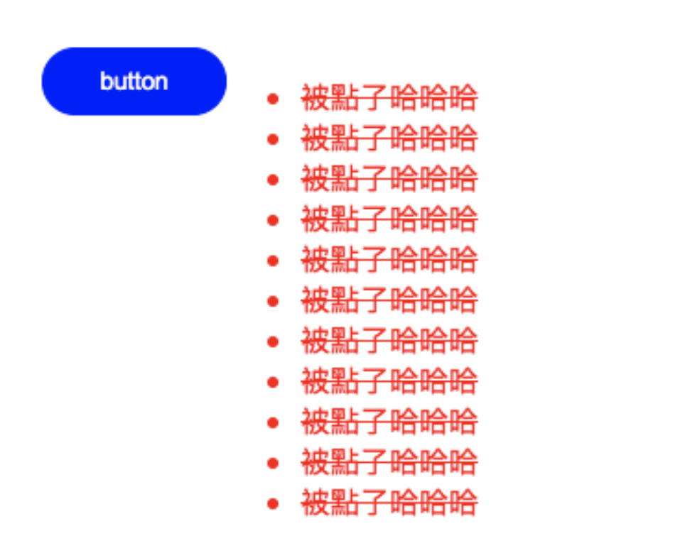
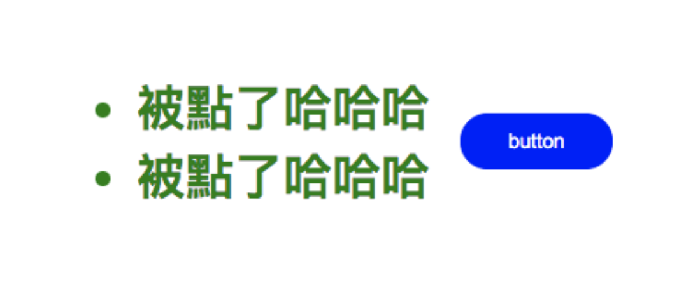

# understanding function invocation

function 是有隱藏的參數，分別為 **argument** & **this**

this 表示此函式所屬的 context

arguments 則表示進行函式呼叫時，傳入的所有引數

arrow function 本身並沒有 arguments、this...等，隱藏的參數

[箭頭函式](https://developer.mozilla.org/zh-TW/docs/Web/JavaScript/Reference/Functions/Arrow_functions)

---

## arguments

arguments 允許我們存取所有函式的參數，不論是否參數使是否有定義

ex.

```js
function returnArguments() {
    return arguments;
}

returnArguments(1, 'afu'); // { 0: 1, 1: "afu" }
```

但他不是 JavaScript 的陣列，故我們無法對 arguments 進行 `Array.prototype` 等相關操作

ex.

```js
function add() {
    return arguments.map((x) => x + 1);
}

console.log(add(1, 2)); // error: Uncaught TypeError: arguments.map is not a function
```

所以建議使用 es6 rest parameter 來取代 arguments，因為 rest parameter 是一個真正的 Array

修改一下上面的程式碼:

```js
function add(...numList) {
    return numList.map((x) => x + 1);
}

console.log(add(1, 2)); // [2,3]
```

arguments 可以做為 函式參數的 alias

換句話說將 arguments[0] 設一個新的值，函數的第一個參數值也會改變

ex.

```js
function sum(a, b, c) {
    arguments[0] = 10;
    console.log(a); // 10
    console.log(a + b + c); // 12;
}
```

避免 alias 我們可以使用 strict mode 來避免

ex.

```js
'use strict';
function sum(a, b, c) {
    arguments[0] = 10;
    console.log(a); // 1
    console.log(a + b + c); // 3;
}
```

---

## this

**this** 指的是與此函式有關聯的物件，因此通常稱他為 `function context`

在其他 OOP 的語言通常指向定義該方法的一個類別實例

但在 JavaScript 中函式被當成方法呼叫，也只是函式的其中一種呼叫方式

所以 **this** 指向的東西 不僅會受到函式定義的方法和位置來決定，也會受到函式呼叫的方式影響

### JavaScript 中，呼叫函式的四種方式

ex.

```js
// 被當 function 呼叫
function ninja(name) { return name }
function afu() {}
ninja('afu'); // afu

// 被當 object 的 method 呼叫
 var ninja = {
	sayMyName: function(name) { return name }
}
ninja.sayMyNmae('afu'); // afu

// 被當 建構式 呼叫
function Human() { .... }
var men = new Human();

// 使用 call 呼叫
ninja.call(afu, 1,2,3);

// 使用 apply 呼叫
ninja.apply(afu, [1,2,3])
```

### 以 function 呼叫的 this

ex.

```js
function ninja() {
    return this;
}

ninja(); // window;

function ninja2() {
    'use strict';
    return this;
}

ninja2(); // undefined;
```

使用 function 的方式，`function context (this)` 在普通模式下會指向 `window` ，在嚴格模式下則會是 `undefined`

---

### 以 object 的 method 呼叫

ex.

```js
var ninja = {
    whoAmI: function () {
        return this;
    },
};

ninja.whoAmI(); // ninja;
```

當我們把 function 作為一個 object 的 method 呼叫時，此 object 就會成為 此 function 的 `function context (this)`

### Q. why?

ex.

```js
var obj = {
    self: this,
};

obj.self; // window
```

["this" inside object](https://stackoverflow.com/questions/7043509/this-inside-object)

---

### function vs object

雖然呼叫是透過變數， 但 function context 仍是 window

ex.

```js
function afu() {
    return this;
}
afu(); // window

//
//
var afu2 = afu;
afu2(); // window
```

透過 ninja 物件的 method 來呼叫，此時 function context 是此物件，這便是物件導向的作法

ex.

```js
var ninja = {
    ninjaAfu: afu,
    ninjaAfu2: afu2,
};

ninja.ninjaAfu(); // ninja
ninja.ninjaAfu2(); // ninja

var ninja2 = {
    ninjaAfu: afu,
    ninjaAfu2: afu2,
};

ninja2.ninjaAfu(); // ninja2
ninja2.ninjaAfu2(); // ninja2
```

ninja 定義了一個名為 ninjaAfu 的 method， ninjaAfu 又是參照 afu
但不能說 afu 是 ninja 的 method，afu 是一個獨立的 function 可以被其他地方自由的使用

ex.

ninja、ninja2 可以使用同一個 function (afu)，該 fucntion 在執行時，存取 or 操作各個所屬的 object

我們不需要為了 object 建立不同的複本進行一樣的操作

這便是物件導向的原則

---

### constructor

ex.

```js
function Ninja() {
    this.whoAmI = function () {
        return this;
    };
}

Ninja();
```

普通模式下 Ninja this 是指向 window，因此 whoAmI 會污染到 Global,

ex.

```js
window.whoAmI(); // window
```

但若使用 constructor

ex.

```js
var ninja1 = new Ninja();
var ninja2 = new Ninja();

ninja.whoAmI(); // ninja1
ninja2.whoAmI(); // ninja2
```

使用 `new` 時，會建立一個空物件，並將其作為 function context，傳遞給 function

建構器會在物件建立一個 `whoAmI` method，並指派 function 給他

使該 function 成為新建立 object 的一個 method

函式建構器 vs 函式建構式
函式建構器：讓我們能夠用動態字串的方式來建立函式 ex. `new Fucntion('a', 'b', 'return a + b')`
函式建構式：建立和初始化物件實體的函式 ex. `var ninja1 = new Ninja`

### Constructor 回傳值

ex.

```js
function Ninja() {
    this.whoAmI = function () {
        return true;
    };
    return 1;
}

Ninja(); // 1

var ninja1 = new Ninja();
ninja1.whoAmI(); // ture
```

若把 Ninja 用函式他會 return 1 , 對程式碼是沒有影響的。

但作為建構式來呼叫，他會建立一個新的物件。

可是...

```js
var config = {
	isLoading: false;
};

function Ninja() {
	this.isLoading = true;
	return config;
};

var ninja1 = new Ninja();

console.log(ninja1 === config); // true;
console.log(ninja1.isLoading === config.isLoading); // false

```

`config` 會被當作是建構式回傳的條件，同時也代表我們建構式會初始化 `function context` 是無效的

若建構式是 return 一個 object，那麼該物件會被當成 `new` 表達式的回傳值，並使 `function context` 初始化無效。
但若建構式 return 不是 object，那麼回傳值會被忽略，並使 `function context` 初始化，回傳新物件。

---

### apply & call

若我可以自訂 `function context` 要指向哪裡，是件多美好的事情啊

試想一個情境

[https://codepen.io/alfredotang-the-styleful/pen/KKVrYKb](https://codepen.io/alfredotang-the-styleful/pen/KKVrYKb)

在這個例子中，瀏覽器的事件處理系統，會將函式呼叫的 `function context` 定義為事件的目標元素

使得 `function context` 會是 `<button>` element ， 而非 `button` 物件

因此 Javascript 制定 apply & call 讓我們可以自訂 `function context`
可以在呼叫 function 的同時，明確指定我們想要的 `function context`

function 作為 First-class， 自然也有 method，就是 apply 、 call 、 bin

ex.

```js
function sum() {
    var result = 0;
    for (var i = 0; i < arguments.length; i++) {
        result += arguments[i];
    }
    this.result = result;
}

const ninja1 = {};
const ninja2 = {};

sum.apply(ninja1, [1, 2, 3, 4]);
sum.call(ninja2, 1, 2, 3, 4);

console.log(ninja1.result); // 10;
console.log(ninja2.result); // 10;
```

建立兩個 object `ninja1` `ninja2` 並分別透過 `apply` `call` 將他們設定成 `function context` 再將引數帶入

apply & call 唯一的差別在於引數的寫法
apply 必須是一個 array
call 則是將多個引數分開列出

---

### 修復 function context 的問題 - arrow function

ex.

```js
function Button() {
    this.clicked = false;
    this.click = function () {
        this.clicked = true;
        assert(button.clicked, '被點了哈哈哈');
    };
}

var button = new Button();

var elem = document.getElementById('test');
elem.addEventListener('click', button.click);
```

修復上述事件處理 `function context` 指向問題，其實只需要使用 `arrow function` 就可以解決

ex.

```js
function Button() {
    this.clicked = false;
    this.click = () => {
        this.clicked = true;
        assert(button.clicked, '被點了哈哈哈');
    };
}

var button = new Button();

var elem = document.getElementById('test');
elem.addEventListener('click', button.click);
```

因為 `arrow function` 沒有自己的 `function context`

而是由定義他們的 function 繼承而來的

`arrow function` 是在建立時取得 `this`

但若不是透過建構式呼叫，而是改由 object 結果恐怕又要令人失望了

ex.

```js
var button = {
  this.clicked = false;
  this.click = () => {
    this.clicked = true;
    assert(button.clicked, "被點了哈哈哈")
  }
}

var elem = document.getElementById("test")
elem.addEventListener('click', button.click)
```



這時候 `arrow function` 的 `this` 會指向 `window` ...

讓我們重申一個觀念： `arrow function` 是在建立時 `this` 取得

由於 object 的實體是建立在 `window` 上，故 `arrow function` 的 `this` 會得到 `window`

ex.

```js
var obj = {
	global: this;
}

console.log(obj.global === window); // true
```

arrow function 無法使用 `bind` 因為他在定義後就不能再 rebind

---

### 修復 function context 的問題 - bind

ex.

```js
var button = {
  this.clicked = false;
  this.click = function() {
    this.clicked = true;
    assert(button.clicked, "被點了哈哈哈")
  }
}

var elem = document.getElementById("test")
elem.addEventListener('click', button.click.bind(button))
```



我們也可以使用 `bind` 指定 `function context` ，

他會建立並回傳新的函式

bind 不會修改原始函式，而是 return 新的函式

ex.

```js
var boundFunction = button.click.bind(button);
console.log(boundFunction !== button.click); // true
```

### Q.React class component

```js

class App extends React.Component {
	constructor(props) {
	  super(props);
		this.handleClick = this.handleClick.bind(this);
	}
	handleClick() {
		....
	}

	handleClickFixByArrowFunction = () => {
		// not need bind
	}
}
```

react class component 中 `handleClick` 需要 bind 自己

[事件處理 - React](https://zh-hant.reactjs.org/docs/handling-events.html)
